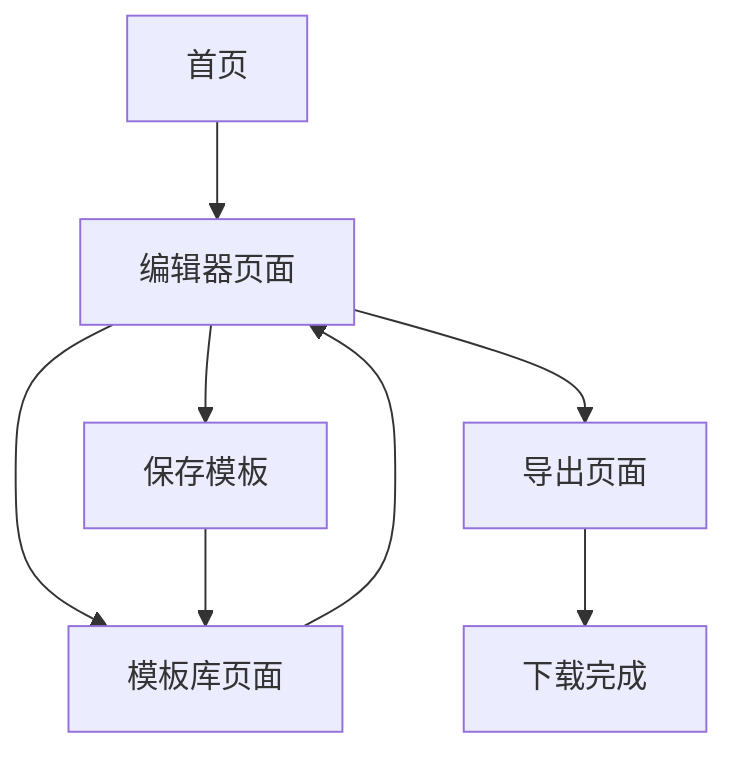

## 1. 产品概述
阅读卡片生成器是一款专业的文字排版工具，用户可以通过输入标题、正文、摘要、作者、日期等基础信息，自由调整字体、行间距、字间距、段落结构、字体大小、配色方案等排版参数，最终导出为高质量的长图。

产品主要解决内容创作者、自媒体运营者、设计师等用户群体对文字美化和视觉呈现的需求，提供便捷的一键式排版和导出功能，让文字内容呈现更加美观专业。

## 2. 核心功能

### 2.1 用户角色
| 角色 | 注册方式 | 核心权限 |
|------|----------|----------|
| 普通用户 | 无需注册 | 使用基础排版功能、导出图片 |
| 高级用户 | 邮箱注册 | 保存模板、云端存储、高级字体 |

### 2.2 功能模块
阅读卡片生成器包含以下核心页面：
1. **编辑器页面**：文字输入、实时预览、参数调整面板
2. **模板库页面**：预设模板选择、自定义模板管理
3. **导出页面**：图片预览、格式选择、下载功能

### 2.3 页面详情
| 页面名称 | 模块名称 | 功能描述 |
|----------|----------|----------|
| 编辑器页面 | 文字输入区 | 输入标题、正文、摘要、作者、日期等基础信息，支持实时编辑和预览 |
| 编辑器页面 | 字体设置面板 | 选择中文字体（包含本地字体文件）、调整字体大小、字体粗细、斜体等样式 |
| 编辑器页面 | 排版设置面板 | 调整行间距、字间距、段落缩进、对齐方式、边距等排版参数 |
| 编辑器页面 | 配色方案面板 | 选择预设配色方案（参考flomo风格）、自定义背景色、文字颜色、强调色 |
| 编辑器页面 | 实时预览区 | 实时显示排版效果，支持缩放预览、滚动查看长图效果 |
| 模板库页面 | 预设模板 | 提供多种精美模板供用户选择，包含不同风格和配色方案 |
| 模板库页面 | 我的模板 | 保存和管理用户自定义的排版模板 |
| 导出页面 | 图片预览 | 全尺寸预览最终效果，支持放大缩小查看细节 |
| 导出页面 | 导出设置 | 选择图片格式（PNG/JPG）、分辨率、文件大小等参数 |
| 导出页面 | 一键下载 | 生成并下载长图到本地设备 |

## 3. 核心流程

### 普通用户流程
1. 进入编辑器页面
2. 在文字输入区填写标题、正文、摘要、作者、日期
3. 在字体设置面板选择合适的中文字体
4. 调整排版参数（行间距、字间距、段落结构）
5. 选择配色方案或自定义颜色
6. 在实时预览区查看效果
7. 点击导出按钮进入导出页面
8. 预览最终效果并调整导出设置
9. 下载生成的长图

### 高级用户流程
1. 注册并登录账号
2. 使用基础编辑功能
3. 保存自定义模板到"我的模板"
4. 从模板库快速应用保存的模板
5. 享受云端存储和高级字体权限

## 4. 用户界面设计

### 4.1 设计风格
- **主色调**：温暖米色 (#F5F1EB) 作为主背景，营造舒适的阅读氛围
- **辅助色**：深灰色 (#2C2C2C) 用于主要文字，浅灰色 (#8B8B8B) 用于次要信息
- **强调色**：暖橙色 (#FF6B35) 用于按钮和重要操作
- **按钮风格**：圆角矩形设计，悬停时有轻微阴影效果
- **字体选择**：界面使用系统默认无衬线字体，确保清晰度
- **布局风格**：左侧编辑面板，右侧实时预览的并排布局
- **图标风格**：使用简洁线性图标，保持界面整洁

### 4.2 页面设计概述
| 页面名称 | 模块名称 | UI元素 |
|----------|----------|----------|
| 编辑器页面 | 文字输入区 | 采用卡片式设计，白色背景，圆角边框，内边距24px，标题输入框使用较大字号(24px) |
| 编辑器页面 | 字体设置面板 | 左侧边栏设计，分组显示字体、大小、样式选项，下拉菜单展示字体预览 |
| 编辑器页面 | 排版设置面板 | 滑块控制间距参数，实时显示数值，提供重置按钮 |
| 编辑器页面 | 配色方案面板 | 网格布局展示配色方案，每个方案显示主色、文字色、背景色预览 |
| 编辑器页面 | 实时预览区 | 模拟真实纸张效果，添加轻微阴影和边框，支持平滑滚动 |
| 模板库页面 | 模板展示 | 网格布局，每个模板显示缩略图和名称，悬停时显示应用按钮 |
| 导出页面 | 图片预览 | 全屏遮罩层，居中显示图片预览，提供缩放控件 |

### 4.3 响应式设计
- **桌面优先**：主要面向桌面端用户，提供完整的编辑功能
- **移动端适配**：在移动设备上提供简化版的预览和导出功能
- **触摸优化**：按钮和交互元素适配触摸操作，增大点击区域

### 4.4 美学追求
- **极致简约**：遵循"少即是多"的设计哲学，每个元素都有存在的意义
- **留白艺术**：充分运用负空间，创造呼吸感和视觉层次
- **细节打磨**：每个像素都经过精心调整，确保视觉和谐统一
- **动效设计**：使用克制而有意义的微交互，如按钮悬停、面板展开等
- **色彩心理学**：选择温暖舒适的配色方案，营造专注的阅读氛围