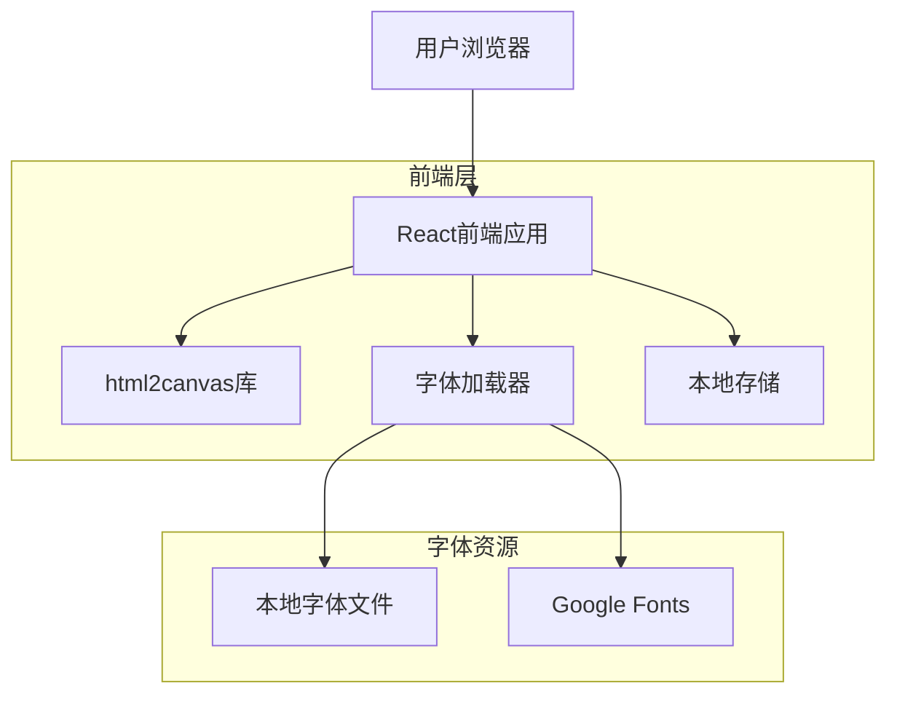

## 1. 架构设计



## 2. 技术描述

- **前端**: React@18 + TypeScript + Vite
- **样式**: Tailwind CSS@3 + 自定义CSS变量
- **图片导出**: html2canvas@1.4
- **字体处理**: FontFace API + 本地字体加载
- **状态管理**: React Context + useReducer
- **初始化工具**: vite-init

## 3. 路由定义

| 路由 | 用途 |
|-------|---------|
| / | 编辑器主页面，包含文字输入和实时预览 |
| /templates | 模板库页面，展示预设和用户自定义模板 |
| /export | 导出页面，图片预览和下载功能 |

## 4. 核心组件架构

### 4.1 主要组件
```typescript
// 编辑器主组件
interface EditorProps {
  content: TextContent;
  settings: TypographySettings;
  onContentChange: (content: TextContent) => void;
  onSettingsChange: (settings: TypographySettings) => void;
}

// 文字内容接口
interface TextContent {
  title: string;
  body: string;
  abstract: string;
  author: string;
  date: string;
}

// 排版设置接口
interface TypographySettings {
  fontFamily: string;
  fontSize: number;
  lineHeight: number;
  letterSpacing: number;
  paragraphIndent: number;
  textAlign: 'left' | 'center' | 'right' | 'justify';
  backgroundColor: string;
  textColor: string;
  accentColor: string;
  padding: number;
}
```

### 4.2 字体管理模块
```typescript
// 字体配置
interface FontConfig {
  name: string;
  displayName: string;
  source: 'local' | 'google';
  url?: string;
  file?: string;
  category: 'serif' | 'sans-serif' | 'monospace';
}

// 字体加载服务
class FontLoader {
  async loadFont(fontConfig: FontConfig): Promise<void>;
  async loadLocalFont(file: File): Promise<string>;
  getAvailableFonts(): FontConfig[];
}
```

## 5. 配色方案系统

### 5.1 预设配色方案（参考flomo风格）
```typescript
interface ColorScheme {
  name: string;
  background: string;
  text: string;
  accent: string;
  secondary: string;
}

const defaultSchemes: ColorScheme[] = [
  {
    name: '温暖米色',
    background: '#F5F1EB',
    text: '#2C2C2C',
    accent: '#FF6B35',
    secondary: '#8B8B8B'
  },
  {
    name: '极简白',
    background: '#FFFFFF',
    text: '#1A1A1A',
    accent: '#2563EB',
    secondary: '#6B7280'
  },
  {
    name: '深空蓝',
    background: '#0F172A',
    text: '#E2E8F0',
    accent: '#60A5FA',
    secondary: '#64748B'
  },
  {
    name: '抹茶绿',
    background: '#F0FDF4',
    text: '#166534',
    accent: '#22C55E',
    secondary: '#16A34A'
  }
];
```

## 6. 图片导出实现

### 6.1 导出配置
```typescript
interface ExportOptions {
  format: 'png' | 'jpeg';
  quality: number;
  scale: number;
  width: number;
  backgroundColor: string;
}

// 导出服务
class ExportService {
  async exportToImage(element: HTMLElement, options: ExportOptions): Promise<Blob>;
  generateFileName(content: TextContent): string;
  downloadImage(blob: Blob, filename: string): void;
}
```

### 6.2 导出优化策略
- **分辨率适配**: 根据设备像素比自动调整导出分辨率
- **字体渲染**: 确保字体在canvas中正确渲染
- **性能优化**: 使用requestAnimationFrame分批处理大文本
- **内存管理**: 及时清理临时canvas对象

## 7. 本地存储设计

### 7.1 存储结构
```typescript
interface LocalStorage {
  // 用户设置
  userSettings: TypographySettings;
  
  // 自定义模板
  customTemplates: Template[];
  
  // 最近使用
  recentContent: {
    content: TextContent;
    timestamp: number;
  }[];
  
  // 字体缓存
  fontCache: {
    [fontName: string]: FontFace;
  };
}
```

### 7.2 存储策略
- **自动保存**: 每30秒自动保存当前编辑内容
- **模板缓存**: 预加载常用字体和模板
- **清理机制**: 定期清理过期的临时数据

## 8. 性能优化

### 8.1 渲染优化
- **虚拟滚动**: 对于长文本使用虚拟滚动技术
- **防抖处理**: 对输入和参数调整进行防抖处理
- **Web Worker**: 复杂的文本处理使用Web Worker

### 8.2 字体加载优化
- **懒加载**: 按需加载字体文件
- **预加载**: 对常用字体进行预加载
- **缓存策略**: 使用IndexedDB缓存字体数据

## 9. 兼容性考虑

### 9.1 浏览器支持
- **现代浏览器**: Chrome 80+, Firefox 75+, Safari 13+
- **polyfill**: 对旧版浏览器提供必要的polyfill
- **降级方案**: 字体加载失败时的降级字体方案

### 9.2 移动端适配
- **触摸优化**: 调整交互元素大小适应触摸操作
- **性能适配**: 根据设备性能调整导出质量
- **存储限制**: 考虑移动设备的存储限制